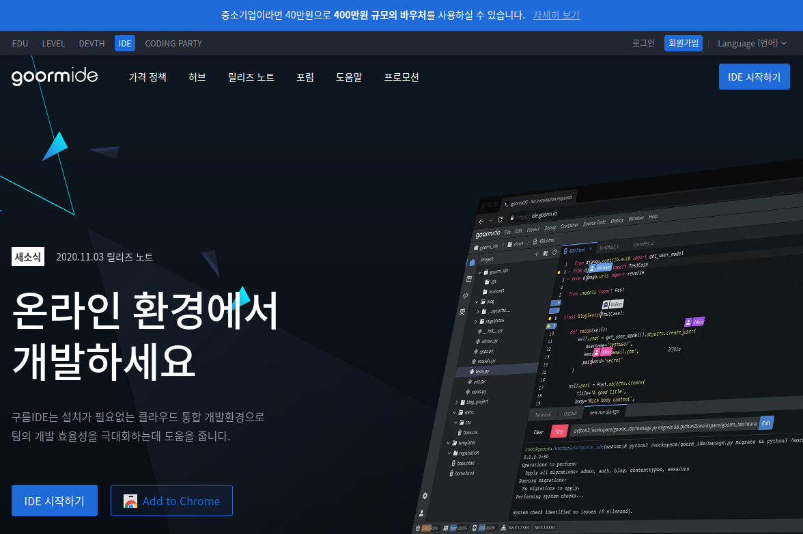
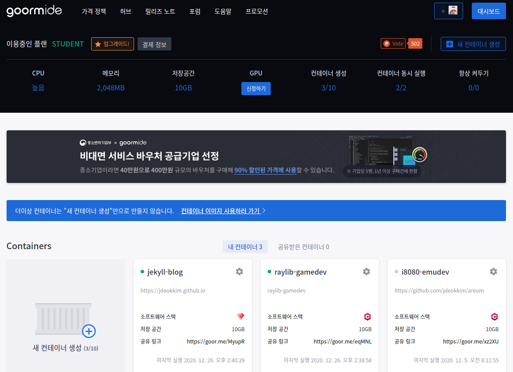
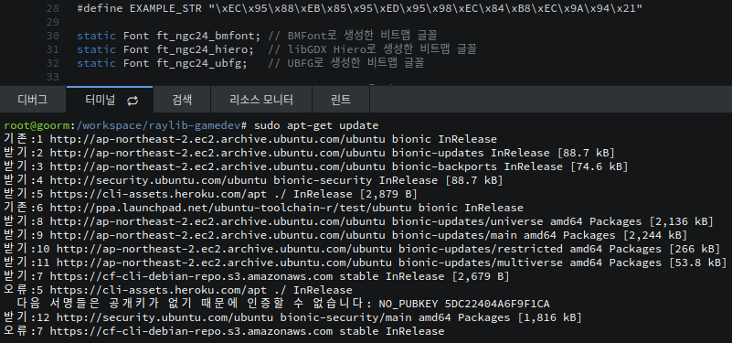
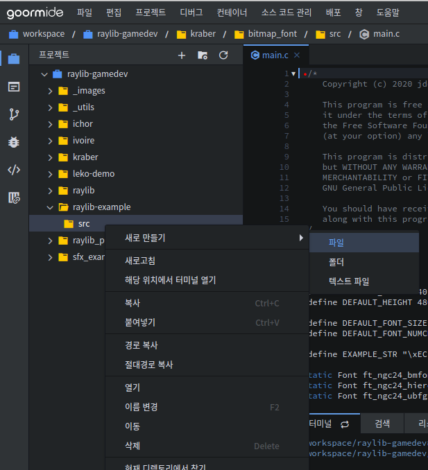
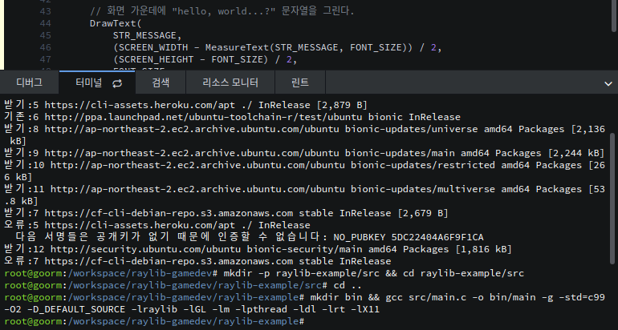
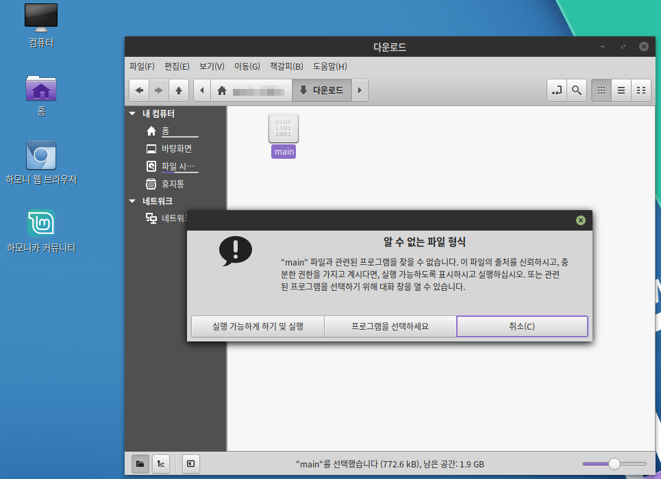

제 `C언어: raylib로 2D 그래픽 게임 만들기` 게시물을 읽어보시는 분들 중에서는 군대 사지방 (사이버 지식 정보방)에서 [하모니카 OS](https://hamonikr.org/)가 설치된 컴퓨터로 게임 개발을 해보고 싶으신 분들이 있을 것입니다. 이번 글에서는 별도의 소프트웨어를 설치하지 않고 온라인으로 프로그래밍을 할 수 있는 환경을 제공해주는 [구름 IDE](https://ide.goorm.io)에서 raylib 프로젝트의 개발 환경을 구축하는 방법을 알아보도록 하겠습니다.

 

# 목차

1. [구름 IDE 가입하고 작업 공간 생성하기](#c1)
2. [작업 공간에서 raylib 개발 환경 구축하기](#c2)

 

## 구름 IDE 가입하고 작업 공간 생성하기 {#c1}

- 먼저 [구름 IDE](https://ide.goorm.io) 웹사이트에 접속하고, 오른쪽 상단의 `회원가입` 버튼을 클릭합니다.

 

- 새로운 계정을 생성합니다. 저 같은 경우는 GitHub 계정이 있어 `다른 서비스로 로그인` 아래의 GitHub 아이콘을 선택하고, 그 계정으로 회원가입을 진행하였습니다.

 

- 회원가입이 끝나고 `대시보드` 버튼을 클릭한 다음, 위 스크린샷과 같은 화면에서 `새 컨테이너 생성`을 클릭합니다.

 

- 컨테이너 생성 화면에서 이름과 설명을 입력한 후, 나머지 항목을 다음과 같이 설정해줍니다.
  - 공개 범위: `Private`
  - 소프트웨어 스택: `C/C++`
    - 템플릿: `C 빈 프로젝트`
    - OS: `Ubuntu 18.04 LTS`
  - 나머지 항목은 그대로 둘 것!

 

- 컨테이너 생성 완료 화면이 뜨면, `컨테이너 실행`을 클릭합니다.

 

## 작업 공간에서 raylib 개발 환경 구축하기 {#c2}

- 여기서부터는 `C언어: raylib로 2D 그래픽 게임 만들기 Pt.1` 게시물의 [우분투 18.04 LTS에서 raylib 라이브러리 빌드하기](https://jdeokkim.github.io/journal/making-a-2d-game-with-raylib-pt-1.html#c3)을 참고하여, 터미널에 명령어를 차례대로 입력하고 실행하면 됩니다.

 

- 구름 IDE에서는 `src` 폴더를 오른쪽 클릭하고 `새로 만들기 -> 파일`을 선택한 다음, `파일 이름`에 `main.c`를 입력하여 파일을 생성할 수도 있습니다.

 

- 마지막 `mkdir bin && gcc src/main.c -o bin/main -g -std=c99 -O2 -D_DEFAULT_SOURCE -lraylib -lGL -lm -lpthread -ldl -lrt -lX11` 명령어까지 실행하면, 왼쪽 탭의 `raylib-example` 폴더 안에 `bin` 폴더가 만들어진 것을 확인할 수 있습니다. 이 `bin` 폴더 안의 `main` 파일을 오른쪽 마우스 클릭 후 `파일 내보내기`를 클릭하여 다운로드합니다.

 

- 하모니카 OS의 바탕화면에서 `홈`을 클릭하고 `다운로드` 폴더로 들어간 다음, `main` 파일을 실행하여 결과를 확인합니다.

 